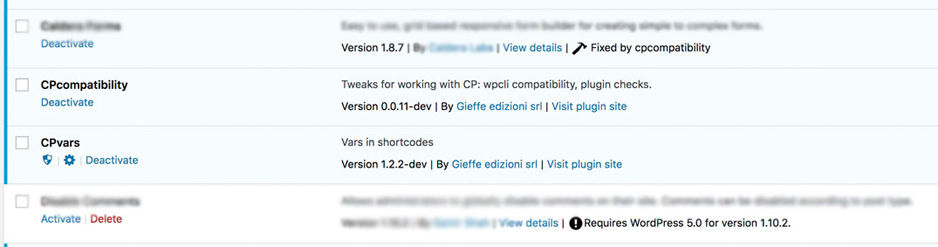
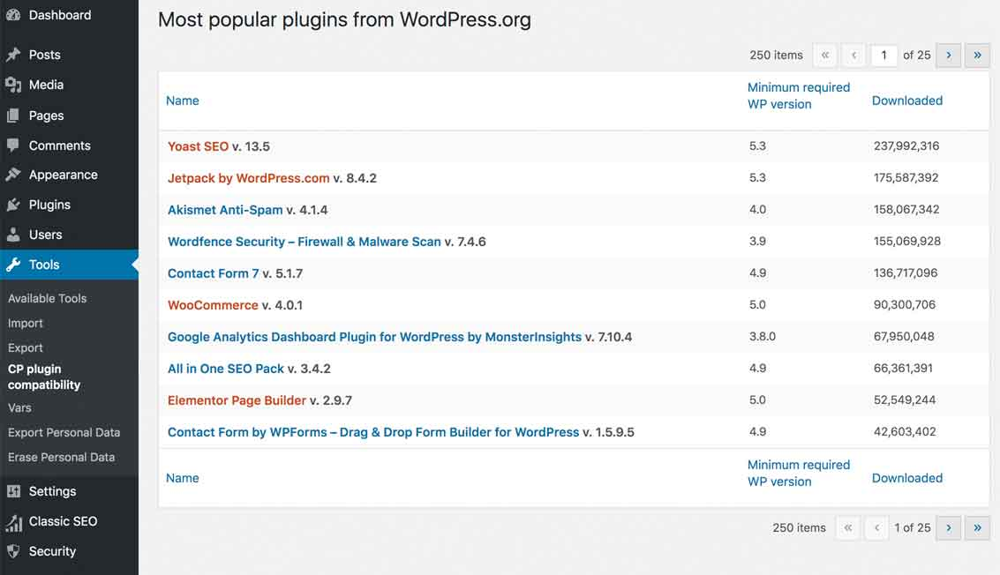

# cpcompatibility
This plugin is for fixing and alerting some compatibility issues for ClassicPress.

## Functions

### Notices on plugin compatibility
* Mark plugins not compatible with WP version 4.9 in plugins admin page
* Add *CP plugin compatibility* under "tools" that displays top 200 plugins from wp.org and their compatibility

### Fix wp-cli 
* Fix `wp core check-update`

## Screenshots

### Privacy
To help us know the number of active installations of this plugin, we collect and store anonymized data when the plugin check in for updates. The date and unique plugin identifier are stored as plain text and the requesting URL is stored as a non-reversible hashed value. This data is stored for up to 28 days.
